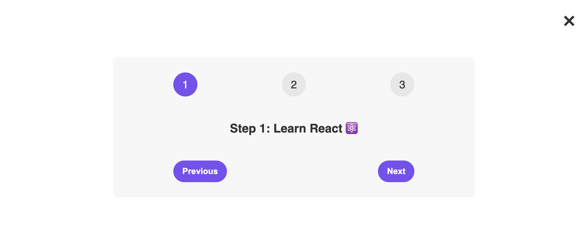
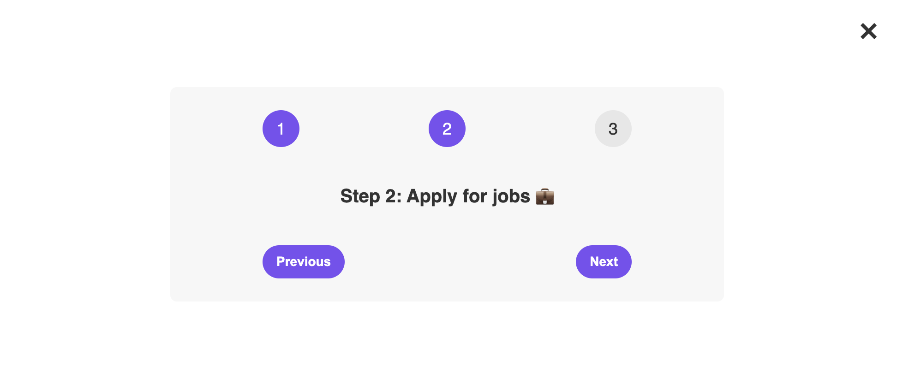
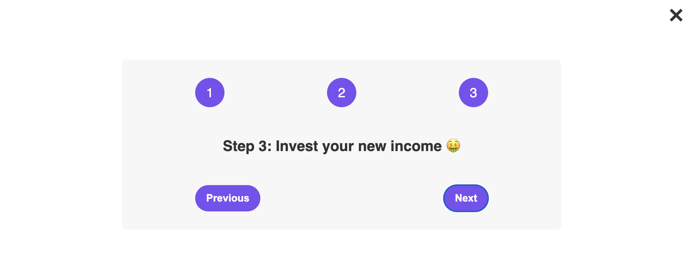

# Steps

## User Story

As a user interested in building a career in tech,
I want a simple and intuitive three-step system
So that I can easily follow the process of learning React, applying for jobs, and managing my new income.

## Acceptance Criteria

GIVEN a user is viewing "Step One: Learn React,"
WHEN the user clicks the "Next" button,
THEN the app will display "Step Two: Apply for Jobs."

GIVEN a user is viewing "Step Two: Apply for Jobs,"
WHEN the user clicks the "Previous" or "Next" button,
THEN the app will navigate to "Step One: Learn React" or "Step 3: Invest in your new income," respectively.

GIVEN a user is viewing "Step 3: Invest in your new income,"
WHEN the user clicks the "Previous" button,
THEN the app will display "Step Two: Apply for Jobs."

## Mock-Up

---

© Adriana Nino
